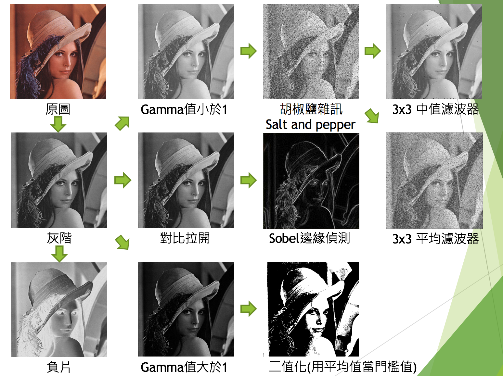
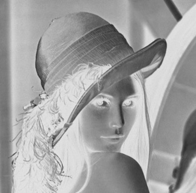
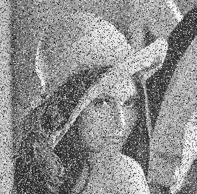
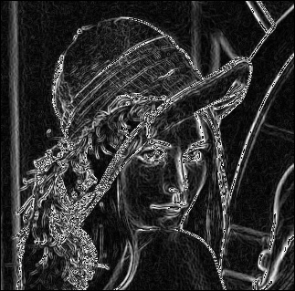
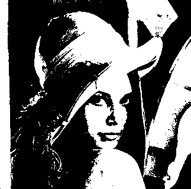

# NCHU Advanced Image Processing

## 影像處理轉換


### 灰階
```
 公式：gray=R*0.299+G*0.587+B*0.114
```
 

### 負片
```
255 - 原像素值
```


### Gamma值小於1
```
[(p(i,j)-min/max-min)^gamma]*255
p(i,j)為像素點之值，min為圖片中像素之最小值，max為圖片中像素之最大值
```


### Gamma值等於1（對比拉開）
```
[(p(i,j)-min/max-min)^gamma]*255
p(i,j)為像素點之值，min為圖片中像素之最小值，max為圖片中像素之最大值
```


### Gamma值小於1
```
[(p(i,j)-min/max-min)^gamma]*255
p(i,j)為像素點之值，min為圖片中像素之最小值，max為圖片中像素之最大值
```


### 胡椒鹽雜訊 Salt and pepper
```
呈現方式是整個影像任意散布黑色或白色
```


### 3x3 平均濾波器
```
先找一個點為中心，把3*3的範圍加總起來做平均寫入覆蓋原本的值。

```


### 3x3 中值濾波器
```
假設圖檔裡面有一組矩陣內容如下，
6  2  0
3  97 4
19 3  10
我們以97為中心點找出3*3的範圍所有的數字，
然後將這組數字依照大小排列得到0,2,3,3,4,6,10,15,97，
接下然我們選擇中間那個數字4取代原本的97做輸出，這樣的做法則稱為中值濾波器。
```


### Sobel邊緣偵測
```
soble加權函數(weighting function)
x,y為
  sobel_x = [[-1,0,1],
      	   [-2,0,2],
      	   [-1,0,1]]

  sobel_y = [[-1,-2,-1],
      	   [ 0, 0, 0],
      	   [ 1, 2, 1]]
  Sobel 方法運算的結果就是
  soble = sqrt[(x^2+y^2)] x平方加上y平方開根號
```


### 二值化（用平均值當門檻值）
```
設一門檻值(數值通常取所有像素之平均值)，大於門檻值則設255，小於則設0
```

